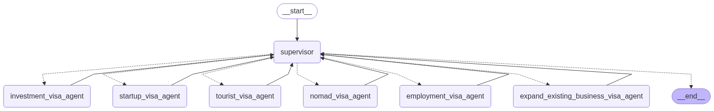

# NextCountry - Visa Information Assistant

NextCountry is an intelligent visa information assistant that helps users navigate through different visa options and requirements. The system uses a supervisor agent architecture to manage multiple specialized visa agents, each handling different types of visas and immigration scenarios.

## Project Structure

The project is organized into several key directories:

- `supervisor_agent/`: Core implementation of the visa information system
- `utils/`: Utility functions and helper modules
- `db/`: Database-related files
- `responses/`: Response templates and examples

## Supervisor Agent System

The supervisor agent system (`supervisor_agent/`) is the heart of the application, managing multiple specialized visa agents:

### Key Components

- `supervisor.py`: Main supervisor implementation that orchestrates the visa agents
- `worker_agents.py`: Contains specialized visa agents for different visa types:
  - Nomad Visa Agent
  - Investment Visa Agent
  - Startup Visa Agent
  - Tourist Visa Agent
  - Employment Visa Agent
  - Expand Existing Business Visa Agent
- `prompt.py`: Contains system prompts and conversation templates
- `tools.py`: Implements various tools and utilities for the agents

### Features

- Multi-agent architecture for handling different visa scenarios
- Intelligent routing of queries to appropriate visa specialists
- State management for maintaining conversation context
- Handoff capabilities between different visa agents
- Pretty printing of responses for better readability

## Getting Started

1. Clone the repository
2. Install the required dependencies
3. Run the supervisor agent system

## Dependencies

The project uses several key libraries:
- LangGraph for agent orchestration
- LLM integration for natural language processing
- Various utility libraries for state management and message handling

## Usage

The system can be used to:
- Get information about different visa types
- Navigate through visa requirements
- Get specialized advice for specific visa scenarios
- Handle complex visa-related queries

---